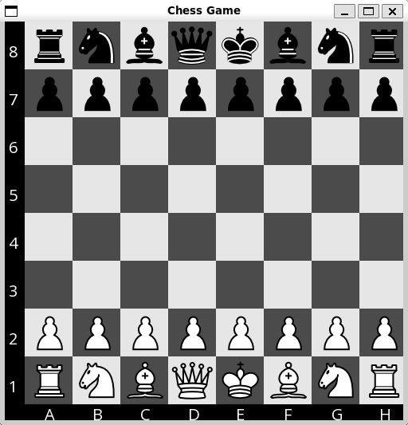

# CppChess

This is a simple chess game with an AI opponent implemented in C++.

## Features & To-Do
- [X] `Play against an AI opponent`
- [X] `Highlight possible moves`
- [ ] `Supports special chess rules (en passant, castling, pawn promotion)`
- [X] `Command-line interface`
- [X] `Graphical user interface`

## Dependencies 
- SFML (Simple and Fast Multimedia Library)

## To compile and run
```bash
    make all
```	



