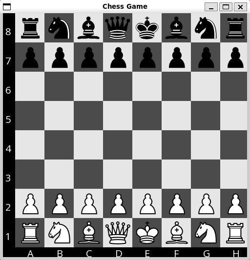

# CppChess

This is a simple chess game with an AI opponent implemented in C++.

## Features & To-Do
- [X] `Play against an AI opponent`
- [X] `Highlight possible moves`
- [ ] `Supports special chess rules (en passant, castling, pawn promotion)`
- [X] `Command-line interface`
- [X] `Graphical user interface`
- [ ] `Configurable AI difficulty and time limit`
- [ ] `Cache pruning to reduce memory usage`

## Dependencies 
- SFML (Simple and Fast Multimedia Library)

## How to run
### On Debian & Ubuntu (or WSL)
```bash
    # to install SFML (if not already installed)
    make install-deps 
    # compile and run
    make
```	
### On Windows
Open the project in Visual Studio and build the project.
SFML needs to be installed on your system, cmake will automatically find the library.

If using vcpkg, you can install SFML with the following command:
```cmd
    vcpkg install sfml
```

## Gameplay screenshot


